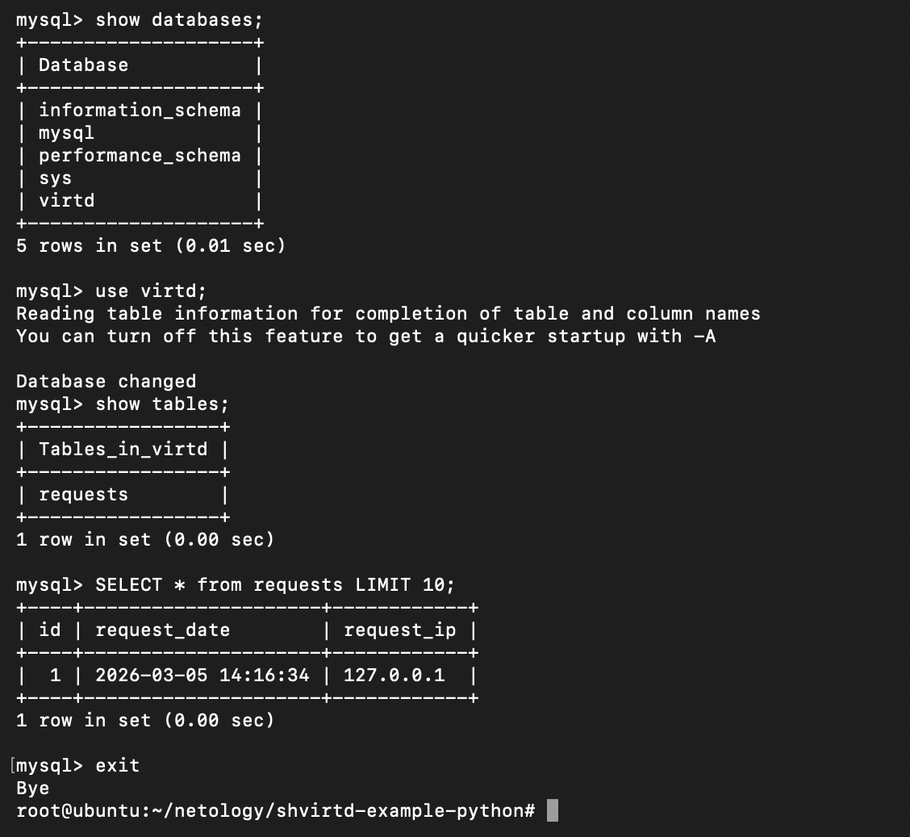
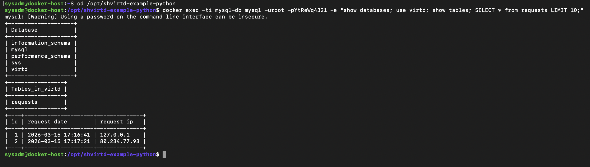
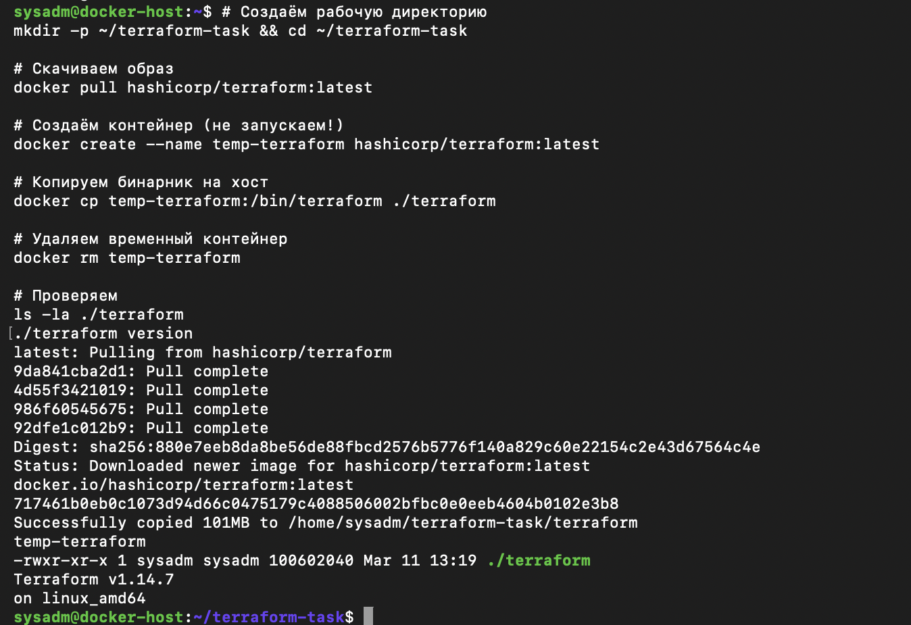
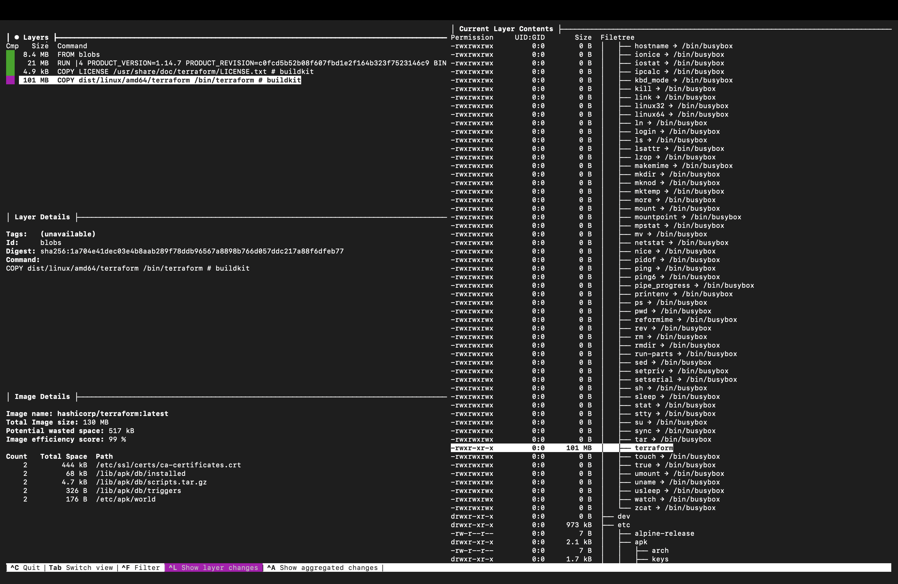
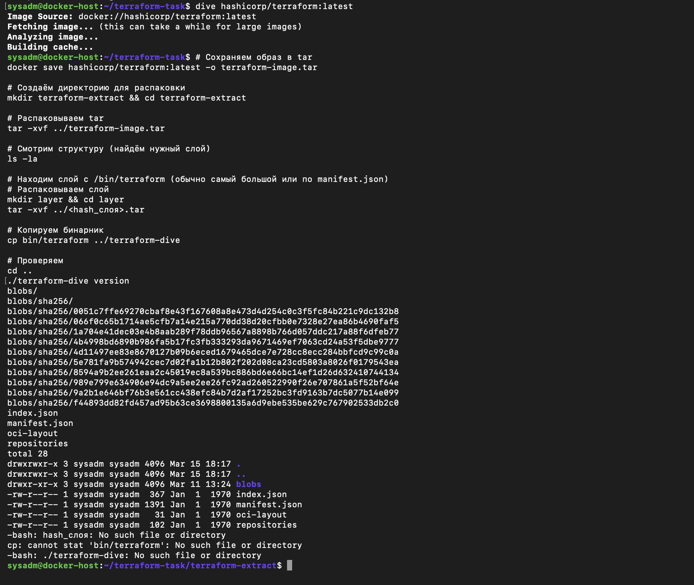

# Решение домашнего задания. «Практическое применение Docker»

## Выполненные задачи

### Задача 0: Проверка Docker Compose

```bash
$ docker compose version
Docker Compose version v5.0.2
```

✅ Проверено локально на macOS


### Задача 1: Создание Dockerfile.python

Файлы добавлены в репозиторий:

Dockerfile.python — multi-stage сборка на базе python:3.12-slim
.dockerignore — исключения для контекста сборки

Особенности:
Используется multi-stage build (builder + production)
Размер образа: ~102 MB
Непривилегированный пользователь appuser
Проверка работы: docker build -f Dockerfile.python -t myapp:latest .

### Задача 3: Docker Compose

Файл compose.yaml с использованием include: proxy.yaml
Сервисы:

web — сборка из Dockerfile.python, IP 172.20.0.5
db — mysql:8, IP 172.20.0.10
reverse-proxy и ingress-proxy из proxy.yaml
Проверка работы:

```bash
$ curl -L http://127.0.0.1:8090
TIME: 2026-03-05 14:30:25, IP: 127.0.0.1
```



SQL-запрос:

```sql

show databases;
use virtd;
show tables;
SELECT * from requests LIMIT 10;
```

Результат: таблица requests создана, запись с IP и временем добавлена.

### Задача 4: Деплой в Yandex Cloud

ВМ: docker-host (2 vCPU, 2 GB RAM, Ubuntu 22.04)
Установка Docker:

```bash
sudo apt-get install -y docker.io docker-compose-plugin
```
Скрипт deploy.sh:

```bash

#!/bin/bash
set -e
cd /opt
sudo rm -rf shvirtd-example-python
sudo git clone https://github.com/dimirDin/shvirtd-example-python.git
cd shvirtd-example-python
sudo chown -R $USER:$USER .
docker-compose up -d
```

Проверка извне:

```plain

http://158.160.47.237:8090
"TIME: 2026-03-15 17:17:21, IP: 80.234.77.93"
```



### Задача 6: Извлечение бинарника Terraform (dive + docker save)

Шаги:
Скачивание образа: docker pull hashicorp/terraform:latest
Сохранение в tar: docker save hashicorp/terraform:latest -o terraform-image.tar
Установка dive: wget ... && sudo dpkg -i dive_0.12.0_linux_amd64.deb
Анализ образа: dive hashicorp/terraform:latest
Распаковка tar: tar -xvf terraform-image.tar
Поиск слоя с /bin/terraform в blobs/sha256/
Извлечение бинарника





### Задача 6.1: Извлечение через docker cp

Команды:

```bash
docker pull hashicorp/terraform:latest
docker create --name temp-terraform hashicorp/terraform:latest
docker cp temp-terraform:/bin/terraform ./terraform
docker rm temp-terraform
./terraform version
```

Результат:

```plain

Terraform v1.14.7 on linux_amd64
```



